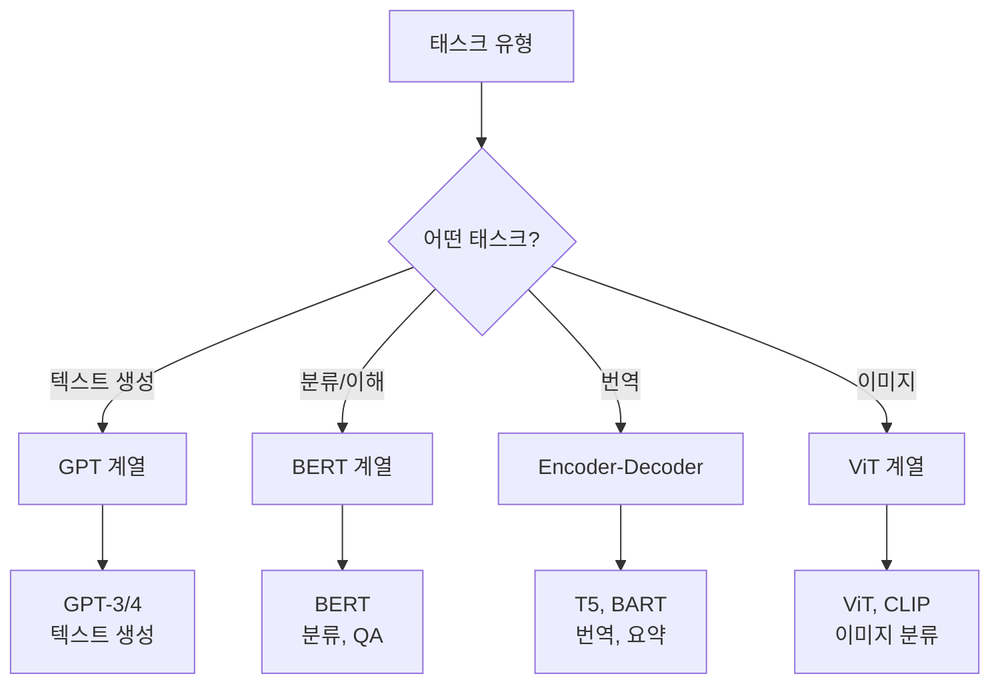

# 트랜스포머 확장 및 응용 분석

## 목차

1. [BERT](#1-bert-bidirectional-encoder-representations-from-transformers)
2. [GPT](#2-gpt-generative-pre-trained-transformer)
3. [Vision Transformer (ViT)](#3-vision-transformer-vit)
4. [트랜스포머가 범용 아키텍처가 된 이유](#4-트랜스포머가-범용-아키텍처가-된-이유)
5. [트랜스포머 진화 비교표](#5-트랜스포머-진화-비교표)

---

## 1. BERT (Bidirectional Encoder Representations from Transformers)

### 1.1 개요

BERT는 Google이 2018년에 발표한 모델로, **양방향(Bidirectional) 문맥**을 이해할 수 있는 Transformer 기반 언어 모델입니다.

### 1.2 구조 설명

#### 기본 아키텍처

- **Transformer Encoder만 사용** (Decoder 없음)
- 입력 문장의 모든 토큰을 동시에 양방향으로 참조
- 12개 레이어 (BERT-Base) 또는 24개 레이어 (BERT-Large)

```
입력: [CLS] I love natural language processing [SEP]
        ↓
    [Transformer Encoder Layers × 12/24]
        ↓
출력: 각 토큰의 문맥적 임베딩
```

#### 주요 특징

**1) 양방향 문맥 이해**

- 일반 Transformer와 달리, 문장의 **왼쪽과 오른쪽 문맥을 모두** 고려
- 예: "I love \_\_"에서 빈칸을 예측할 때, "I"와 "natural language"를 모두 참조

**2) 특수 토큰**

- `[CLS]`: 문장의 시작 토큰 (Classification 태스크용)
- `[SEP]`: 문장 구분 토큰 (두 문장을 입력할 때 사용)
- `[MASK]`: 마스킹된 토큰

### 1.3 Transformer와의 차이점

| 구분          | Transformer                        | BERT                        |
| ------------- | ---------------------------------- | --------------------------- |
| **구조**      | Encoder + Decoder                  | Encoder만                   |
| **문맥 방향** | Encoder는 양방향, Decoder는 단방향 | 완전한 양방향               |
| **학습 방법** | 번역 태스크                        | Masked Language Model + NSP |
| **주요 용도** | 번역                               | 문장 분류, 질의응답, NER 등 |

### 1.4 학습 방법

#### Masked Language Model (MLM)

- 입력 문장의 **15%를 랜덤하게 마스킹**하고, 이를 예측하도록 학습
- 예:
  ```
  원본: I love natural language processing
  입력: I love [MASK] language processing
  목표: "natural" 예측
  ```

#### Next Sentence Prediction (NSP)

- 두 문장이 **연속된 문장인지** 판별하도록 학습
- 예:
  ```
  문장 A: I love NLP
  문장 B: It is very interesting
  레이블: IsNext (연속된 문장)
  ```

### 1.5 응용 분야

- **텍스트 분류**: 감정 분석, 스팸 분류 등
- **질의응답(QA)**: SQuAD 등
- **개체명 인식(NER)**: Named Entity Recognition
- **문장 유사도**: Semantic Similarity

---

## 2. GPT (Generative Pre-trained Transformer)

### 2.1 개요

GPT는 OpenAI가 개발한 **생성형(Generative)** 언어 모델로, Transformer의 **Decoder만 사용**합니다.

### 2.2 구조 설명

#### 기본 아키텍처

- **Transformer Decoder만 사용** (Encoder 없음)
- **단방향(Unidirectional) 문맥**: 왼쪽에서 오른쪽으로만 참조
- Auto-regressive 방식: 이전 토큰들을 바탕으로 다음 토큰 예측

```
입력: I love natural language
        ↓
    [Transformer Decoder Layers]
        ↓
출력: processing (다음 단어 예측)
```

#### 주요 특징

**1) 단방향 문맥**

- 현재 위치의 토큰은 **이전 토큰만** 참조 가능
- 미래 토큰은 볼 수 없음 (Causal Masking)

**2) Auto-regressive 생성**

- 한 번에 한 토큰씩 순차적으로 생성
- 예: "I" → "I love" → "I love natural" → ...

### 2.3 BERT와의 차이점

| 구분            | BERT                               | GPT                           |
| --------------- | ---------------------------------- | ----------------------------- |
| **구조**        | Encoder만                          | Decoder만                     |
| **문맥 방향**   | 양방향                             | 단방향 (왼쪽 → 오른쪽)        |
| **학습 목표**   | Masked Language Model              | Next Token Prediction         |
| **주요 용도**   | 분류, 질의응답 등                  | 텍스트 생성                   |
| **예시 태스크** | "I love \_\_ language" → "natural" | "I love natural" → "language" |

### 2.4 GPT 시리즈 진화 과정

#### GPT-1 (2018)

- **파라미터**: 117M
- **특징**: Transformer Decoder 기반, Unsupervised Pre-training + Supervised Fine-tuning
- **성능**: 여러 NLP 태스크에서 좋은 성능

#### GPT-2 (2019)

- **파라미터**: 1.5B
- **특징**: Zero-shot Learning 가능, Fine-tuning 없이도 다양한 태스크 수행
- **논란**: 너무 강력해서 처음엔 공개하지 않음

#### GPT-3 (2020)

- **파라미터**: 175B
- **특징**: Few-shot Learning, Prompt Engineering
- **성능**: 인간 수준의 텍스트 생성

#### GPT-4 (2023)

- **파라미터**: 공개되지 않음 (추정 ~1T)
- **특징**: Multimodal (텍스트 + 이미지), 더욱 향상된 성능
- **응용**: ChatGPT, 코딩 지원, 복잡한 추론 등

### 2.5 응용 분야

- **텍스트 생성**: 소설, 기사, 이메일 작성
- **대화형 AI**: ChatGPT
- **코드 생성**: GitHub Copilot
- **번역, 요약, 질의응답** 등

---

## 3. Vision Transformer (ViT)

### 3.1 개요

Vision Transformer는 Google이 2020년에 발표한 모델로, **이미지 분류에 Transformer를 직접 적용**한 최초의 모델입니다.

### 3.2 구조 설명

#### 기본 아이디어

- 이미지를 **작은 패치(patch)로 나누고**, 각 패치를 **토큰처럼 처리**
- Transformer Encoder를 사용하여 패치 간의 관계를 학습

#### 처리 과정

```
1. 이미지를 패치로 분할
   예: 224×224 이미지 → 16×16 패치 = 196개 패치

2. 각 패치를 선형 변환으로 임베딩
   16×16×3 → 768차원 벡터

3. 위치 임베딩 추가
   (각 패치의 위치 정보 제공)

4. [CLS] 토큰 추가
   (이미지 전체의 표현)

5. Transformer Encoder 통과

6. [CLS] 토큰으로 분류
   예: 고양이/개 분류
```

#### 수식

```
입력 이미지: x ∈ R^(H×W×C)
패치 크기: P×P
패치 수: N = HW / P²

패치 임베딩: z₀ = [x_cls; x₁E; x₂E; ...; x_N E] + E_pos
```

### 3.3 CNN과의 차이점

| 구분                     | CNN                                     | Vision Transformer        |
| ------------------------ | --------------------------------------- | ------------------------- |
| **처리 방식**            | 국소적 필터 (local)                     | 전역적 어텐션 (global)    |
| **inductive bias**       | 강함 (locality, translation invariance) | 약함                      |
| **데이터 요구량**        | 적음                                    | 많음 (대규모 데이터 필요) |
| **계산 복잡도**          | O(N)                                    | O(N²)                     |
| **성능 (대규모 데이터)** | 좋음                                    | 매우 좋음                 |

#### Inductive Bias란?

- **CNN**: "가까운 픽셀끼리 관련이 있을 것"이라는 가정
- **ViT**: 그런 가정 없이 **데이터로부터 학습**

### 3.4 주요 특징

**1) 패치 기반 처리**

- 이미지를 패치로 나누어 처리 → Transformer에 입력 가능

**2) Self-Attention으로 전역 정보 학습**

- CNN의 제한적인 receptive field와 달리, **모든 패치 간의 관계**를 한 번에 학습

**3) 확장성**

- 모델 크기를 키울수록 성능 향상 (Scaling Law)

### 3.5 응용 분야

- **이미지 분류**: ImageNet 등
- **객체 탐지**: DETR (Detection Transformer)
- **세그멘테이션**: Segmentation Transformer
- **멀티모달**: CLIP (이미지-텍스트 매칭)

---

## 4. 트랜스포머가 범용 아키텍처가 된 이유

### 4.1 Self-Attention의 강력함

#### 장점

1. **장거리 의존성(Long-range Dependency) 학습**
   - RNN/LSTM은 멀리 떨어진 단어 간의 관계를 학습하기 어려움
   - Transformer는 모든 위치 간의 관계를 직접 계산

2. **유연한 관계 모델링**
   - 입력의 모든 요소 간 관계를 동적으로 학습
   - 예: "The animal didn't cross the street because **it** was too tired"
     - "it"이 "animal"을 가리킨다는 것을 Self-Attention으로 학습

### 4.2 병렬 처리 가능성

#### RNN/LSTM vs Transformer

**RNN/LSTM**

- 순차적 처리 필수 (t번째 출력은 t-1번째 출력에 의존)
- 병렬화 불가 → 학습 속도 느림

**Transformer**

- 모든 위치를 동시에 처리
- 완전한 병렬화 가능 → GPU 활용도 높음

### 4.3 확장성 (Scaling)

#### Scaling Law

- 모델 크기, 데이터 크기, 계산량을 늘릴수록 성능 향상
- GPT-3 (175B) > GPT-2 (1.5B) > GPT-1 (117M)

#### 범용성

- NLP: BERT, GPT
- Vision: ViT
- Audio: Audio Transformer
- Multimodal: CLIP, Flamingo

→ **하나의 아키텍처로 모든 도메인 커버 가능**

### 4.4 전이 학습(Transfer Learning)의 용이성

#### Pre-training + Fine-tuning 패러다임

1. **Pre-training**: 대규모 데이터로 일반적인 지식 학습
2. **Fine-tuning**: 특정 태스크에 맞게 미세 조정

→ 적은 데이터로도 높은 성능 달성 가능

### 4.5 아키텍처의 단순함과 일반성

- **단순한 구성**: Attention + Feed-Forward + Residual + Norm
- **도메인 독립적**: 입력을 토큰화만 하면 어떤 데이터든 처리 가능
- **확장 가능**: 레이어 추가, 헤드 추가 등 쉽게 확장

---

## 5. 트랜스포머 진화 비교표

### 5.1 주요 모델 비교

| 모델            | 연도 | 구조              | 학습 방법                | 주요 응용             | 파라미터                    |
| --------------- | ---- | ----------------- | ------------------------ | --------------------- | --------------------------- |
| **Transformer** | 2017 | Encoder + Decoder | Supervised (번역)        | 기계 번역             | ~65M                        |
| **BERT**        | 2018 | Encoder only      | MLM + NSP                | 분류, QA, NER         | 110M (Base)<br>340M (Large) |
| **GPT-1**       | 2018 | Decoder only      | Next Token Prediction    | 텍스트 생성           | 117M                        |
| **GPT-2**       | 2019 | Decoder only      | Next Token Prediction    | 텍스트 생성           | 1.5B                        |
| **GPT-3**       | 2020 | Decoder only      | Next Token Prediction    | 텍스트 생성, Few-shot | 175B                        |
| **ViT**         | 2020 | Encoder only      | Supervised (이미지 분류) | 이미지 분류           | 86M (Base)<br>632M (Huge)   |
| **GPT-4**       | 2023 | Decoder only      | Next Token Prediction    | Multimodal AI         | ~1T (추정)                  |

### 5.2 학습 방법 비교

#### Supervised Learning

- **Transformer (원본)**: 입력-출력 쌍으로 학습 (예: 영어 → 한글)

#### Self-Supervised Learning

- **BERT**: 일부를 마스킹하고 예측 (MLM)
- **GPT**: 다음 토큰 예측 (Auto-regressive)

#### Transfer Learning

- **Pre-training**: 대규모 데이터로 일반 지식 학습
- **Fine-tuning**: 특정 태스크에 맞게 조정

### 5.3 아키텍처 선택 가이드



### 5.4 트랜스포머 계보

```
2017: Transformer (Attention Is All You Need)
        ↓
     ┌──┴──┐
     ↓     ↓
  Encoder  Decoder
     ↓     ↓
  ┌──┴──┐  └────────┐
  ↓     ↓           ↓
BERT   ViT        GPT-1
2018   2020        2018
  ↓                ↓
RoBERTa          GPT-2
ALBERT           2019
  ↓                ↓
  ...            GPT-3
                 2020
                   ↓
                 GPT-4
                 2023
```

### 5.5 핵심 개념 요약

| 개념                     | 설명                                          |
| ------------------------ | --------------------------------------------- |
| **Self-Attention**       | 입력 시퀀스의 모든 요소 간 관계를 학습        |
| **Multi-Head Attention** | 여러 개의 어텐션을 병렬로 사용                |
| **Positional Encoding**  | 위치 정보를 제공 (순환 구조 없이도 순서 인식) |
| **Encoder**              | 입력을 문맥적 표현으로 변환 (양방향)          |
| **Decoder**              | 출력을 순차적으로 생성 (단방향)               |
| **Pre-training**         | 대규모 비지도 학습으로 일반 지식 획득         |
| **Fine-tuning**          | 특정 태스크에 맞게 모델 조정                  |

---

## 6. 결론

### 트랜스포머의 핵심 성공 요인

1. ✅ **Self-Attention**: 장거리 의존성을 효과적으로 포착
2. ✅ **병렬 처리**: 빠른 학습 속도
3. ✅ **확장성**: 모델/데이터 크기 증가 → 성능 향상
4. ✅ **범용성**: NLP, Vision, Audio 등 모든 도메인에 적용 가능
5. ✅ **전이 학습**: Pre-training + Fine-tuning으로 적은 데이터로도 고성능

### 미래 전망

- **Multimodal AI**: 텍스트, 이미지, 오디오를 동시에 처리 (GPT-4, Gemini 등)
- **효율성 개선**: Sparse Attention, Linear Attention 등
- **더 큰 모델**: Trillion-parameter 모델 등장 예정
- **새로운 응용**: 과학, 의료, 교육 등 다양한 분야로 확장

트랜스포머는 단순한 아키텍처이지만, **Attention 메커니즘의 강력함** 덕분에 AI의 패러다임을 완전히 바꾸었습니다!
